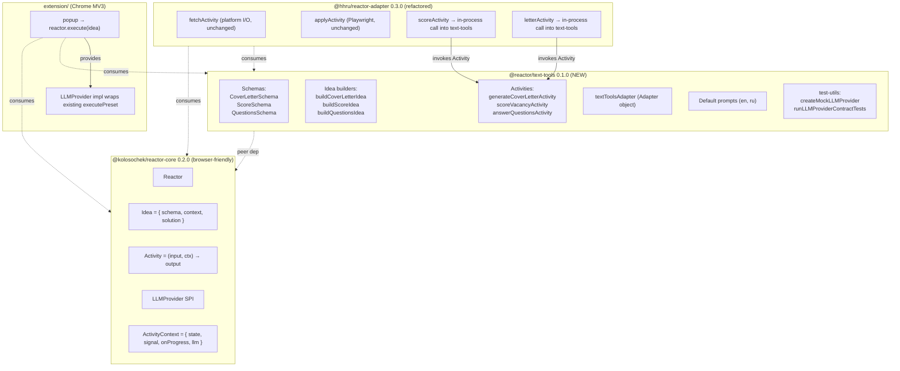
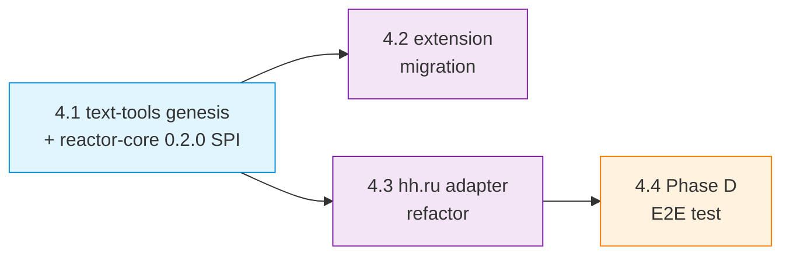
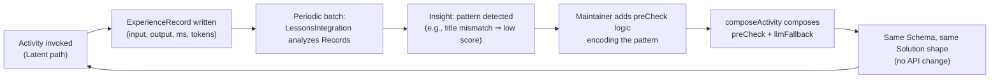

# Decouple Pipeline from Platform: text-tools as Idea-Triplet Domain Adapter

> ⚠️ **SUPERSEDED 2026-04-26** by `docs/superpowers/specs/2026-04-26-reactor-service-design.md`. Brainstorming continued past this spec and produced a fundamental architectural pivot: Reactor is a microservice (per pokeroid `runtime/REACTOR.md:80-86`), not an embedded library. Sub-project 4.1 (text-tools genesis) was shipped against the design below and remains valid (text-tools is now a service-internal dependency). Sub-projects 4.2, 4.3, 4.4 from this document are REPLACED by the successor spec's 4.0 + 4.2 + 4.3 + 4.4 sequence. Read the successor spec for current direction.

> Spec author: brainstorming session 2026-04-26.
> Status: SUPERSEDED.
> Successor docs: per-sub-project plans under `docs/superpowers/plans/2026-04-2X-*.md`.

## TL;DR

The hh.ru pipeline is platform-coupled at every layer: every step takes a `vacancyId: number` (a hh.ru DB row id) and reaches into hh.ru's SQLite to read the vacancy text. The Chrome extension already has the *correct* shape - it operates on `vacancy: string` (any pasted text) - but its implementation is a parallel codebase, duplicating the LLM logic.

This spec extracts the platform-agnostic LLM operations into a new package `@reactor/text-tools` that becomes the single source of truth. Both the Chrome extension and the hh.ru-specific reactor-adapter consume it. The package is built strictly on the **Idea Triplet** paradigm from pokeroid's Reactor vision: every operation is a self-contained `Idea = { schema, context, solution }` executed via `reactor.execute(idea)`. No partial states, no callback shortcuts, no platform leakage.

**Decisions locked in this brainstorm:**
- Approach B (extract shared `text-tools`, not refactor adapter in place)
- B1 (score is in text-tools, not hh.ru-specific)
- Deep unification on reactor-core (extension takes the dep)
- Strict Idea-Triplet (every call is `reactor.execute(idea)`)
- Decouple-first ordering before Phase D

**Decomposition:** four sub-projects - **4.1** text-tools genesis (foundation, includes reactor-core 0.2.0 SPI patch), **4.2** extension migration, **4.3** hh.ru-adapter refactor, **4.4** Phase D end-to-end test. Each gets its own brainstorm → spec → plan → execute cycle.

---

## Goals

1. **Decouple text-LLM operations from hh.ru platform coupling.** `scoreVacancy`, `generateCoverLetter`, `answerQuestions` must accept a vacancy as `{ title, description, url?, platform? }` directly - no DB round-trip required.
2. **Single implementation, two consumers.** Chrome extension and hh.ru reactor-adapter share one set of Activities, schemas, prompts, and tests. Drift between the two surfaces is impossible because the code is the same code.
3. **Strict Idea-Triplet paradigm.** Every operation is invoked as `reactor.execute(idea)`. The `Idea` is the sole unit of communication. No callback shortcuts, no half-states, no partial data passing.
4. **Browser-friendly.** text-tools and reactor-core must run in a Chrome extension's service worker without Node-specific dependencies (no `fs`, no `child_process`).
5. **Foundation for crystallization.** Per pokeroid REACTOR.md, today's Latent (LLM-driven) operations must be replaceable with Explicit (deterministic) implementations as patterns emerge. Activity composition seam stays in place from day one.

## Non-goals (Out of scope)

- **Implementing crystallization.** Today every Activity is 100% Latent. Phase 1 of crystallization (deterministic skill matcher, template-based letter scaffolding) is out of scope; only the composition seam is built now.
- **Replacing reactor-core's existing surfaces.** The `Reactor`, `Idea`, `LLMProvider`, repositories, and IdeaBuilder stay as-is. Only `ActivityContext` gets one new field.
- **Removing the hh.ru bash CLI scripts.** `scripts/cli/{score,letter,apply,fetch}.ts` continue to exist; their internals migrate from server-spawned LLM calls to in-process text-tools invocations.
- **End-to-end pipeline test against running dev server.** Sub-project 4.4 (Phase D) covers it, but it's last and depends on the prior three sub-projects.
- **LLM quality / prompt evaluation.** Prompts are ported as-is from extension and hh.ru server. Iterating on prompt quality is a separate ongoing activity.

---

## Drivers (why now)

User identified four motivations:

| | Driver | Implication |
|---|---|---|
| A | **Multi-platform** | LinkedIn / Indeed / hh.ru vacancies through the same pipeline without forcing each into hh.ru schema |
| B | **Manual paste** | User pastes a job description from anywhere; immediately get score, letter, answers without scraping |
| C | **Test isolation** | Score/letter activities in unit tests work without DB and without network - pure LLM operations on text |
| D | **Architectural cleanliness** | Separate "platform I/O" (fetch/apply) from "text-LLM work" (score/letter/answer) on principle |

Plus a fifth driver, surfaced during brainstorming:

| | Driver | Implication |
|---|---|---|
| E | **Existing parallel implementation** | `extension/src/lib/actions/{generateCoverLetter,answerQuestions}.ts` already runs LLM operations on raw text. The pipeline is duplicated; converging on one source of truth is overdue. |

All five drivers point to the same architecture: a shared text-LLM package consumed by both the extension and the hh.ru adapter.

---

## Architecture

### High-level



### Data flow comparison: before vs after

**Before (hh.ru-coupled):**

```
caller → buildHhruPipelineIdea({ vacancyIds: [42] }) → reactor.execute
       → adapter score Activity
       → spawnCli('bash', ['scripts/hhru-score.sh', '42'])
       → tsx scripts/cli/score.ts
       → tRPC client → server tRPC handler
       → DB SELECT vacancy WHERE id=42
       → call OpenRouter with vacancy text + resume
       → server writes to DB
       → CLI emits SummaryEvent
       → adapter parses summary
       → returns to caller
```

**After (decoupled):**

```
caller → buildScoreIdea({ vacancy: { title, description }, resume }) → reactor.execute
       → text-tools scoreVacancyActivity
       → ctx.llm.complete(...)  ← LLMProvider injected from Reactor
       → returns ScoreSolution { score, reasoning, skillMatch }
```

For the hh.ru adapter case, the in-process flow stays identical to text-tools; the only added work is the DB read (via tRPC `vacancies.listByIds`) before invocation and the DB write after. The bash CLI subprocess and server-side LLM execution disappear.

---

## Component design

### 1. Idea triplets for the three tools

Each tool defines (a) a JSON-Schema describing its input shape, (b) a Zod schema for runtime validation, (c) a builder constructing an Idea ready for `reactor.execute`, and (d) a typed Solution.

#### 1.1 generateCoverLetter

```ts
// text-tools/src/tools/coverLetter.ts

import { z } from 'zod'
import { zodToJsonSchema } from 'zod-to-json-schema'
import type { JSONSchema7 } from 'json-schema'

const VacancyShape = z.object({
  title: z.string(),
  description: z.string(),
  url: z.string().url().optional(),
  platform: z.string().optional(),  // 'hh.ru' | 'linkedin' | 'manual' | string
})

const ResumeShape = z.object({
  title: z.string(),
  content: z.string(),
})

export const CoverLetterInput = z.object({
  vacancy: VacancyShape,
  resume: ResumeShape,
  prompt: z.string().optional(),    // when omitted, default prompt for the locale
  locale: z.enum(['en', 'ru']).default('en'),
})

export const CoverLetterSolution = z.object({
  letter: z.string().min(1),
  tokensUsed: z.number().int().nonnegative().optional(),
  durationMs: z.number().int().nonnegative(),
})

export const CoverLetterSchema: JSONSchema7 = zodToJsonSchema(CoverLetterInput) as JSONSchema7

export type CoverLetterInputT = z.infer<typeof CoverLetterInput>
export type CoverLetterSolutionT = z.infer<typeof CoverLetterSolution>
```

Builder (constructs Idea directly, mirroring the existing reactor-adapter pattern - `IdeaBuilder` forces a tools-palette schema we don't need here):

```ts
// text-tools/src/builders.ts

import { createMeta } from '@kolosochek/reactor-core'
import type { Idea, MetaMessage, DataMessage } from '@kolosochek/reactor-core'
import { CoverLetterInput, type CoverLetterInputT } from './tools/coverLetter.js'

export function buildCoverLetterIdea(input: CoverLetterInputT): Idea {
  // Validate at construction time. Idea always carries valid input by invariant.
  const parsed = CoverLetterInput.parse(input)

  const meta = createMeta('text-tools', `/cover-letter/${new Date().toISOString()}`, {
    version: '0.1.0',
  })
  const metaMsg: MetaMessage = { type: 'meta', role: 'system', meta }

  // DataMessage with _call triggers executeDirect mode in Reactor.detectMode()
  // (see Reactor.ts:175). Activity receives _call as input.
  const dataMsg: DataMessage = {
    type: 'data',
    role: 'system',
    data: parsed,                                    // referenceable copy of input
    _call: { _tool: 'generateCoverLetter', ...parsed },
    _date: new Date().toISOString(),
  }

  return {
    schema: { type: 'object' },                      // minimal placeholder; tools registered via Adapter
    context: [metaMsg, dataMsg],
    solution: null,
  }
}
```

Two things to notice:
1. The Idea's `schema` is intentionally minimal `{ type: 'object' }`. Tool palette is not part of the Idea - it's the Adapter that registers tools (`textToolsAdapter.tools`). This mirrors how `@hhru/reactor-adapter`'s `buildHhruPipelineIdea` constructs Ideas today and avoids the IdeaBuilder's mandatory tool-set schema.
2. `_call: { _tool: 'generateCoverLetter', ...parsed }` triggers `executeDirect` mode (per `Reactor.detectMode`). The Activity receives `_call` as `input`, so `input._tool` is set; the Activity strips `_tool` and reads the rest.

#### 1.2 scoreVacancy

```ts
// text-tools/src/tools/score.ts

export const ScoreInput = z.object({
  vacancy: VacancyShape,
  resume: ResumeShape,
  prompt: z.string().optional(),
  locale: z.enum(['en', 'ru']).default('en'),
})

export const SkillMatch = z.object({
  matched: z.array(z.string()),  // skills present in both
  missing: z.array(z.string()),  // required-but-absent
  extra: z.array(z.string()),    // resume-has-but-vacancy-doesn't
})

export const ScoreSolution = z.object({
  score: z.number().int().min(0).max(100),
  reasoning: z.string().min(1),
  skillMatch: SkillMatch.optional(),
  tokensUsed: z.number().int().nonnegative().optional(),
  durationMs: z.number().int().nonnegative(),
})

export const ScoreSchema: JSONSchema7 = zodToJsonSchema(ScoreInput) as JSONSchema7
```

#### 1.3 answerQuestions

```ts
// text-tools/src/tools/questions.ts

export const QuestionsInput = z.object({
  vacancy: VacancyShape,
  resume: ResumeShape,
  questions: z.array(z.string().min(1)).min(1),
  prompt: z.string().optional(),
  locale: z.enum(['en', 'ru']).default('en'),
})

export const QuestionAnswerPair = z.object({
  question: z.string(),
  answer: z.string(),
})

export const QuestionsSolution = z.object({
  qaPairs: z.array(QuestionAnswerPair),
  tokensUsed: z.number().int().nonnegative().optional(),
  durationMs: z.number().int().nonnegative(),
})
```

### 2. SPI extension on reactor-core

The patch is wider than just adding `ctx.llm`. Auditing the current Reactor reveals that the `ActivityContext` type already declares `signal` and `onProgress` as optional, **but `executeDirect/executeBatch` only populate `{ state }`**. So today there is no way to abort an Activity, no way to receive progress events, and now also no way to call the LLM. All three need to be wired in this patch.

#### 2a. Type extension

```ts
// reactor-core/src/types/adapter.ts (current)
export interface ActivityContext {
  onProgress?: (event: ProgressEvent) => void
  signal?: AbortSignal
  state: Record<string, unknown>
}

// reactor-core/src/types/adapter.ts (new)
export interface ActivityContext {
  onProgress?: (event: ProgressEvent) => void
  signal?: AbortSignal
  state: Record<string, unknown>
  llm: LLMProvider                    // NEW: same provider Reactor was constructed with
}
```

#### 2b. Reactor.execute opts

`Reactor.execute(idea)` gains an optional second parameter so callers can pass a signal and progress sink without putting them inside the Idea (those are execution concerns, not data):

```ts
// reactor-core/src/reactor/Reactor.ts (current)
async execute(idea: Idea): Promise<Solution>

// reactor-core/src/reactor/Reactor.ts (new)
async execute(
  idea: Idea,
  opts?: { signal?: AbortSignal; onProgress?: (event: ProgressEvent) => void }
): Promise<Solution>
```

#### 2c. ctx wiring

Each of `executeDirect`, `executeBatch`, `executeScenario` builds the `ActivityContext` from Reactor instance state plus opts:

```ts
const ctx: ActivityContext = {
  state: localState,
  llm: this.llm,                      // from Reactor.create({ llm })
  signal: opts?.signal,               // from execute(idea, { signal })
  onProgress: opts?.onProgress,       // from execute(idea, { onProgress })
}
const output = await activity(resolvedArgs, ctx)
```

#### 2d. Backward compatibility

Existing Activities (hh.ru `fetchActivity`, `applyActivity`, current `scoreActivity`/`letterActivity`) read only `state` from ctx; adding three more fields is additive. Phase A/B/C tests pass unchanged. Reactor-core version bumps 0.1.0 → 0.2.0 (minor, additive SPI extension).

### 3. Activity implementation

Each text-tools Activity follows a uniform structure: validate input, build LLM messages, call `ctx.llm.complete`, parse + validate output, return Solution.

Composition seam (Section 8) is built in from day one:

```ts
// text-tools/src/activity/compose.ts

import type { ActivityContext } from '@kolosochek/reactor-core'

export type CrystallizableActivity<I, O> = (input: I, ctx: ActivityContext) => Promise<O>

export interface ActivityLayers<I, O> {
  /** Returns a deterministic Solution if the case is crystallized; null to fall through. */
  preCheck?: (input: I) => O | null
  /** Required: the LLM-based fallback. */
  llmFallback: CrystallizableActivity<I, O>
  /** Optional: post-process LLM output (validation, structure checks). */
  postValidate?: (input: I, output: O) => O
}

export function composeActivity<I, O>(layers: ActivityLayers<I, O>): CrystallizableActivity<I, O> {
  return async (input, ctx) => {
    if (layers.preCheck) {
      const explicit = layers.preCheck(input)
      if (explicit !== null) return explicit
    }
    const latent = await layers.llmFallback(input, ctx)
    return layers.postValidate ? layers.postValidate(input, latent) : latent
  }
}
```

Initial Activity uses only `llmFallback`:

```ts
// text-tools/src/activities/coverLetter.ts

import type { Activity } from '@kolosochek/reactor-core'
import { composeActivity } from '../activity/compose.js'
import { CoverLetterInput, CoverLetterSolution } from '../tools/coverLetter.js'
import { defaultCoverLetterPrompt } from '../prompts/coverLetter.js'

export const generateCoverLetterActivity: Activity = composeActivity({
  llmFallback: async (rawInput, ctx) => {
    const input = CoverLetterInput.parse(rawInput)
    const startedAt = Date.now()
    const prompt = input.prompt ?? defaultCoverLetterPrompt[input.locale]
    const userContent = [
      '## Vacancy',
      input.vacancy.title,
      '',
      input.vacancy.description,
      '',
      '## Resume Title',
      input.resume.title,
      '',
      '## Resume Content',
      input.resume.content,
    ].join('\n')

    const response = await ctx.llm.complete({
      messages: [
        { role: 'system', content: prompt },
        { role: 'user', content: userContent },
      ],
      signal: ctx.signal,
    })

    return CoverLetterSolution.parse({
      letter: response.content,
      tokensUsed: response.tokensUsed ?? undefined,
      durationMs: Date.now() - startedAt,
    })
  },
})
```

`scoreVacancyActivity` and `answerQuestionsActivity` follow the same pattern, with one differentiator: `scoreVacancyActivity` requests `jsonMode: true` from the LLM and parses the structured output. The Activity catches `LLMOutputParseError` (Section 7) when the LLM returns malformed JSON.

### 4. textToolsAdapter

The Adapter object that consumers register with `reactor.use(...)`:

```ts
// text-tools/src/adapter.ts

import type { Adapter } from '@kolosochek/reactor-core'
import { CoverLetterTool, CoverLetterSchema, generateCoverLetterActivity } from './...'
// ... etc

export const textToolsAdapter: Adapter = {
  name: 'text-tools',
  version: '0.1.0',
  tools: [CoverLetterTool, ScoreTool, QuestionsTool],
  activities: {
    generateCoverLetter: generateCoverLetterActivity,
    scoreVacancy: scoreVacancyActivity,
    answerQuestions: answerQuestionsActivity,
  },
  domain: textToolsDomain,
}
```

`textToolsDomain` is a `DomainContext` with paradigm `'job-text-llm'`, entities `['vacancy', 'resume', 'cover-letter', 'question']`, actions `['score', 'draft', 'answer']`. Used only in Reactor's scenario mode (where the LLM picks one tool); not load-bearing today.

### 5. Dual-mode invocation: direct (extension) vs batch (hh.ru pipeline)

text-tools Activities are invoked through Reactor in two distinct modes depending on the consumer. The Activities themselves are mode-agnostic - same code path, same input shape.

#### Direct mode (extension popup, manual paste use case)

Single-tool, single-call. `buildCoverLetterIdea` produces an Idea with a `DataMessage._call`, which `Reactor.detectMode` recognizes as `'direct'`:

```ts
const idea = buildCoverLetterIdea({ vacancy, resume })
const solution = await reactor.execute(idea, { signal })
// solution.calls[0]._tool === 'generateCoverLetter'
// solution.output === { letter, tokensUsed?, durationMs }
```

#### Batch mode (hh.ru adapter pipeline, multi-step)

Multi-tool plan. The adapter's existing `buildHhruPipelineIdea` produces an Idea with a `PlanMessage` containing multiple `PlanCall`s. After 4.3, the score and letter calls inside that PlanMessage point to text-tools tool names (`scoreVacancy`, `generateCoverLetter`); the fetch and apply calls continue to point to hh.ru-specific tools (`hhruFetch`, `hhruApply`).

```ts
const idea = buildHhruPipelineIdea({ vacancyIds, resumes })
const solution = await reactor.execute(idea)
// plan.calls = [{ _tool: 'hhruFetch', ... }, { _tool: 'scoreVacancy', ... }, ...]
// state populated: { fetch: ..., score: ..., letter: ..., apply: ... }
```

In batch mode, the adapter pre-step fetches vacancy text from DB (via tRPC `vacancies.listByIds`) and substitutes it into the PlanCall args. The Activity itself never knows whether it was invoked directly or as part of a plan - same input shape (`{ vacancy: { title, description }, resume }`), same Solution.

This dual-mode usage is a load-bearing design property: it lets the same text-tools Activity serve both the "user pasted a vacancy" case (extension) and the "pipeline iterates over fetched vacancies" case (adapter) without conditional logic.

### 6. Default prompts

Ports of existing prompts from extension and hh.ru server, organized as:

```
text-tools/src/prompts/
├── coverLetter.en.txt
├── coverLetter.ru.txt
├── score.en.txt
├── score.ru.txt
├── questions.en.txt
└── questions.ru.txt
```

Each prompt is exported as a string constant:

```ts
// text-tools/src/prompts/coverLetter.ts
export const defaultCoverLetterPrompt = {
  en: '... (port from extension/src/lib/prompts/coverLetter.en)',
  ru: '...',
}
```

Caller can override via `CoverLetterInput.prompt` field. Prompts are content; iterating on them is a separate process.

---

## Package layout

```
/Users/noone/data/
├── ereal/
│   └── reactor-core/                    @kolosochek/reactor-core 0.2.0
│       └── (own git repo, npm-publishable)
│
└── hhru/                                npm workspace root
    ├── package.json                     workspaces: ["packages/*", "extension"]
    │                                    (currently only "packages/*", + extension joins)
    ├── packages/
    │   ├── reactor-adapter/             @hhru/reactor-adapter 0.3.0 (refactored to consume text-tools)
    │   └── text-tools/                  @reactor/text-tools 0.1.0 (NEW)
    │       ├── src/
    │       │   ├── tools/               { coverLetter, score, questions }.ts (Zod + JSONSchema)
    │       │   ├── activities/          { coverLetter, score, questions }.ts (composeActivity)
    │       │   ├── activity/
    │       │   │   └── compose.ts       composeActivity factory
    │       │   ├── adapter.ts           textToolsAdapter
    │       │   ├── builders.ts          buildXxxIdea(...)
    │       │   ├── domain.ts            textToolsDomain
    │       │   ├── prompts/             default prompts (en, ru)
    │       │   ├── test-utils/          createMockLLMProvider, runLLMProviderContractTests
    │       │   └── index.ts             public exports
    │       ├── package.json             peer dep on @kolosochek/reactor-core ^0.2.0
    │       └── tsconfig.json
    └── extension/                       Chrome extension; joins workspaces
        └── package.json                 deps: @reactor/text-tools, @kolosochek/reactor-core
```

### Dependency direction

```
extension                ─consumes→  @reactor/text-tools ─peer→ @kolosochek/reactor-core
@hhru/reactor-adapter    ─consumes→  @reactor/text-tools ─peer→ @kolosochek/reactor-core
@hhru server (later)     ─consumes→  @reactor/text-tools (optional, after CLI refactor)
```

### Extension joining workspaces

Root `package.json` change:
```diff
-  "workspaces": ["packages/*"],
+  "workspaces": ["packages/*", "extension"],
```

Extension can now `import { ... } from '@reactor/text-tools'` via npm workspace symlink. No publish step needed for development.

---

## Migration: four sub-projects

Each sub-project gets its own brainstorm → spec → plan → execute cycle. They are NOT bundled into one mega-plan.

### 4.1 text-tools genesis

**Goal:** package exists, all three Activities work in isolation against a mock LLM, no consumer migrations yet.

**Tasks (high level; full plan to be written separately):**
1. SPI patch on reactor-core: extend `ActivityContext` with `llm: LLMProvider`. Bump 0.1.0 → 0.2.0. Tests + publish to local file: link.
2. Bootstrap `packages/text-tools/` workspace: `package.json`, `tsconfig.json`, `vitest.config.ts`.
3. Define schemas, builders, default prompts (en + ru) for all three tools.
4. Implement `composeActivity` and the three Activities (Latent-only).
5. Implement `textToolsAdapter` and `textToolsDomain`.
6. Implement `test-utils`: `createMockLLMProvider`, `runLLMProviderContractTests`.
7. Tests: per-Activity unit tests (mock LLM), Activity-via-Reactor.execute integration tests, schema contract tests.
8. README, CHANGELOG, public exports verified.

**Dependencies:** none.

**Outcome:** `npm i @reactor/text-tools` and an arbitrary caller can construct `Reactor.create({ llm }).use(textToolsAdapter)`, then `reactor.execute(buildCoverLetterIdea({...}))` returns a `CoverLetterSolution`.

### 4.2 extension migration

**Goal:** the Chrome extension uses text-tools as its only LLM-operations source. Existing `extension/src/lib/actions/{generateCoverLetter,answerQuestions}.ts` are removed.

**Tasks (high level):**
1. Wrap extension's `executePreset` as an `LLMProvider` implementation.
2. Bootstrap a Reactor instance at extension boot, register `textToolsAdapter`.
3. Replace direct calls to `generateCoverLetter(...)` in popup with `reactor.execute(buildCoverLetterIdea(...))`.
4. Replace `answerQuestions(...)` similarly.
5. Map the resulting `Solution` to existing `HistoryEntry` storage (extension keeps its own persistence).
6. Delete obsolete actions code.
7. Run `runLLMProviderContractTests` against extension's LLMProvider impl.
8. Manual smoke test: extension popup generates a cover letter on a real pasted vacancy.

**Dependencies:** 4.1.

**Outcome:** extension is the first production consumer of text-tools. The pasted-text path (driver B) works end-to-end.

### 4.3 hh.ru-adapter refactor

**Goal:** `@hhru/reactor-adapter` consumes text-tools for score and letter operations. Server-side LLM execution is removed.

**Tasks (high level):**
1. CLI scripts `scripts/cli/{score,letter}.ts` migrate from "spawn → tRPC → server-side LLM" to "tRPC fetch vacancy → in-process text-tools call → tRPC mutation write".
2. Adapter Activities `packages/reactor-adapter/src/activities/{score,letter}.ts` refactor: replace `spawnCli` of bash wrappers with in-process `composedActivity` invocation that wraps text-tools.
3. `applyActivity` and `fetchActivity` stay platform-specific (Playwright + scraping); they don't move to text-tools.
4. Pipeline factory `buildHhruPipelineIdea`: PlanCalls for score and letter now point to text-tools tool names (`scoreVacancy`, `generateCoverLetter`); PlanCalls for fetch and apply continue to point to hh.ru-specific tools.
5. Server-side `submitScoreVacancyTask` and `submitGenerateLetterTasks` workers refactor: instead of executing LLM in worker, they fetch vacancy text from DB and run text-tools Activity in-process.
6. Existing 73 adapter tests continue to pass; new tests verify the text-tools-backed score/letter pipeline.
7. Existing CLI flag surface (`hhru:score 42`, `--auto`, `--min-score N --no-letter`, etc.) preserved; only the LLM path under the hood changes.

**Dependencies:** 4.1.

**Outcome:** the hh.ru pipeline runs through the same text-tools Activities as the extension. One source of truth in production.

### 4.4 Phase D - end-to-end pipeline integration test

**Goal:** the long-deferred Phase D from the original reactor isolation spec. End-to-end test against a running dev server with Drizzle/SQLite repositories and a real fixture preset.

**Tasks (high level):** unchanged from the original Phase C plan's "out-of-scope for Phase C" list. After 4.1-4.3, this test exercises the **decoupled** architecture - meaning we test it once, against the right shape.

**Dependencies:** 4.3 (and indirectly 4.1).

**Outcome:** the original Phase D shipped, but against architecture that didn't exist when it was first specified.

### Ordering rationale



- **4.1 first**: unblocks both 4.2 and 4.3. Includes the reactor-core 0.2.0 SPI patch (extending `ActivityContext`) - itself a non-breaking version bump that other consumers ignore.
- **4.2 and 4.3 in parallel**: independent consumers, different code paths. A separate session/subagent could pick one each.
- **4.4 last**: tests the decoupled architecture, not the coupled one. If Phase D ran first, the test harness would be built around `vacancyId`-based PlanCalls and would need rewriting after 4.3.

Decouple-first saves one full rewrite of the E2E test infrastructure.

---

## Testing strategy

### Layered pyramid

| Layer | Owns | Mocks |
|---|---|---|
| reactor-core | Reactor.execute mode dispatch, Idea immutability, `ActivityContext.llm` propagation | mock Activity, mock LLMProvider |
| text-tools | Activity unit behavior (Latent path), Schema contract, Builder ergonomics, Adapter shape | mock LLMProvider only |
| reactor-adapter | fetch + apply (unchanged), score/letter via text-tools (new), pipeline integration (4-step) | mock LLMProvider, mock spawn (for fetch/apply) |
| extension | popup → reactor.execute → letter rendered, ExperienceRecord → HistoryEntry mapping | mock LLMProvider |

### Mock LLMProvider as a first-class artifact

`text-tools/src/test-utils/mockLLM.ts`:

```ts
export function createMockLLMProvider(opts?: {
  onComplete?: (req: LLMCompletionRequest) => Promise<LLMCompletionResponse>
  fixedResponses?: Record<string, LLMCompletionResponse>  // map by message-fingerprint
}): LLMProvider {
  return {
    name: 'mock',
    async complete(req) {
      if (opts?.onComplete) return opts.onComplete(req)
      // default: echo input
      return { content: 'mock response', model: 'mock' }
    },
  }
}
```

Tests build an Idea, call `reactor.execute(idea)`, assert on the resulting Solution shape. Tests do NOT primarily assert on what the LLM was called with - that's an implementation detail. Schema-level assertions on Solution are the contract.

### LLMProvider conformance suite

text-tools exports a test suite that any `LLMProvider` implementation can run:

```ts
// text-tools/src/test-utils/contract.ts
export function runLLMProviderContractTests(
  describe: VitestDescribe,
  factory: () => LLMProvider,
): void {
  describe('LLMProvider contract', () => {
    it('returns content for non-empty messages', async () => { ... })
    it('honors AbortSignal', async () => { ... })
    it('respects jsonMode if requested', async () => { ... })
    it('throws typed error on network failure', async () => { ... })
    it('reports tokensUsed if provider supports it', async () => { ... })
  })
}
```

Both extension and adapter use this suite to verify their LLMProvider impls satisfy the contract.

### Golden fixtures

`text-tools/fixtures/`:
- Anonymized real vacancies (3-5 examples covering seniority/role variety)
- Anonymized real resumes
- Expected Solutions (canonical Latent output for each vacancy x resume pair)

Fixtures serve two purposes today (regression detection across prompt iterations) and one tomorrow (canonical Latent output for crystallization regression - Section "Crystallization roadmap").

### What NOT to test in CI

- Real LLM provider network calls (gated `RUN_LLM=1` env for manual evals)
- LLM output quality (separate ML-evaluation activity, not a unit test)

---

## Error handling

### Typed error hierarchy

All errors inherit from `TextToolsError` (exported from `@reactor/text-tools`).

| Class | Cause | Recoverable? | Surface |
|---|---|---|---|
| `IdeaSchemaError` | Builder received input not matching Schema (Zod fail) | No - caller bug | Builder caller |
| `IdeaContextMissingError` | execute() saw Idea without required Messages | No - factory bug | Factory author |
| `LLMTimeoutError` | LLM provider didn't respond before signal timeout | Yes - retry-safe | execute() caller |
| `LLMQuotaError` | 429 / quota exceeded | Yes - retry with backoff | execute() caller |
| `LLMNetworkError` | Generic network failure | Yes - retry-safe | execute() caller |
| `LLMOutputParseError` | LLM returned content not parseable into expected Schema (jsonMode mismatch) | Rarely - try different prompt | execute() caller |
| `ActivityCancelledError` | signal.aborted after Activity started | Terminal - user cancelled | execute() caller |

Error classes carry structured fields (e.g., `LLMOutputParseError.rawContent` for debugging, `LLMQuotaError.retryAfterMs`).

### Idea triplet stays consistent at all times

Per pokeroid REACTOR.md: no partial states. Solution is either filled or null.

```
Idea { schema, context, solution: null }
                ↓
        reactor.execute(idea)
                ↓
        ┌───────┴───────┐
        ↓               ↓
   Solution         throw TextToolsError
   (filled)         (idea.solution stays null)
```

Caller knows: either the Idea matured to a Solution, or it didn't. No "half-filled" intermediate. The original Idea is never mutated (Plan A T26 immutability lock).

### ExperienceRecord on failure

Reactor already writes `ExperienceRecord` for both success and failure outcomes. New optional field added in this work:

```ts
interface ExperienceRecord {
  // existing fields ...
  outcome: 'success' | 'failure'
  errorMessage?: string
  errorClass?: string  // NEW: structured error class name for downstream classification
}
```

Downstream analysis (lessons, predictions, retry logic) uses `errorClass` to classify behavior. Extension uses it to decide UI feedback (timeout = "Try again", quota = "Switch model").

### Schema-fenced LLM output for structured tools

`scoreVacancyActivity` and `answerQuestionsActivity` request structured output from the LLM:

```ts
const response = await ctx.llm.complete({
  messages,
  jsonMode: true,
  signal: ctx.signal,
})

const parsed = tryParseJSON(response.content) ?? extractJSONFromMarkdown(response.content)
if (!parsed) throw new LLMOutputParseError({ rawContent: response.content, expectedSchema: 'ScoreSolution' })

return ScoreSolution.parse(parsed)  // Zod validation; throws ZodError on shape mismatch
```

Activities do NOT auto-retry. The caller (or Reactor.execute caller) decides retry policy from `errorClass`.

### Cancellation

`ActivityContext.signal: AbortSignal` is required to be propagated to LLM:

```ts
await ctx.llm.complete({ messages, signal: ctx.signal })
```

If the signal aborts before LLM responds, the Activity throws `ActivityCancelledError`. Same shape across all three Activities.

---

## Crystallization roadmap

Per pokeroid REACTOR.md, the Reactor architecture is designed for "Latent → Explicit Crystallization": today's LLM-driven (Latent) operations gradually crystallize into deterministic (Explicit) ones as patterns emerge from accumulated experience.

This section describes the roadmap. **None of it is implemented in 4.1.** What's built now is the seam (`composeActivity` with `preCheck` and `postValidate` hooks) that makes future crystallization a one-function addition rather than a refactor.

### Per-tool roadmap

| Tool | Latent (today) | Phase 1 crystallization | Phase 2 crystallization |
|---|---|---|---|
| **scoreVacancy** | LLM reads vacancy + resume, emits `{ score, reasoning, skillMatch }` | `preCheck`: regex/embeddings skill matcher computes `skillMatch.{matched, missing, extra}`. LLM receives pre-extracted skills, focuses only on score + reasoning | Fully deterministic for clear cases (skill match >90% or <10%); LLM only for grey zone 30-70% |
| **generateCoverLetter** | LLM generates the entire letter | `postValidate`: checks structure (intro + skill mentions + closing); rejects letters without expected components | Template engine fills standard slots (greeting, closing, contact); LLM only for creative parts (vacancy-specific opener, company-specific motivation) |
| **answerQuestions** | LLM answers each question separately | `preCheck`: lookup table for standard questions (salary, start date, relocation) - reads from resume metadata | LLM only for open-ended questions; standard answers fully deterministic |

### Crystallization feedback loop



Reactor-core already has the building blocks: `LessonsIntegration` (T17 in Plan A), `PredictionGenerator` (T19), `CrystallizationEngine` (T20a). They are built but not wired into `Reactor.execute`. Wiring them is its own future sub-project (post-4.4).

### What 4.1 does to enable crystallization

1. **All Activities use `composeActivity` from day one.** Adding `preCheck` later is a new layer parameter, not a rewrite.
2. **Every Activity emits structured `ExperienceRecord`** with input + output + ms + tokens (in Reactor.execute, not Activity-local). Ensures raw data exists for analysis.
3. **`createMockLLMProvider` writes to Experience identically** in tests. Tests accumulate "what prompt → what output" data, useful for prompt regression detection.
4. **Schemas (CoverLetterInput, ScoreInput, QuestionsInput) are canonical and stable.** preCheck and postValidate write against these schemas; they don't change as crystallization advances.

---

## Risks

| Risk | Likelihood | Impact | Mitigation |
|---|---|---|---|
| **Extension bundle size** grows beyond MV3 budget after pulling reactor-core + text-tools | Low | Medium | reactor-core is pure JS + native fetch; estimated 15-30 KB minified. Measure in 4.2; if a problem, tree-shake aggressively or split text-tools into lite/full subpaths |
| **Phase C adapter tests regress** when 4.3 swaps bash CLI for in-process text-tools | Medium | High | Existing 73 tests stay; add migration to incrementally replace one Activity at a time; if any test fails, fix or document divergence before merging |
| **Prompt drift** between extension and hh.ru server during port - producing different LLM outputs | High | Medium | Pick canonical per tool (Open Question #4); add fixture tests using `createMockLLMProvider` so any prompt change is visible in diff |
| **LLM provider non-conformance**: extension's `executePreset` doesn't match the LLMProvider contract (e.g., signal not honored, jsonMode unsupported) | Medium | Medium | `runLLMProviderContractTests` is mandatory in 4.2; failures block migration |
| **Server worker no longer runs LLM** - changes operational profile (concurrency, cost attribution, observability) | Medium | Low | Document deployment change in 4.3 plan; run dev:worker observability checks before/after |
| **Idea immutability accidentally violated** - text-tools Activity mutates its input | Low | High | Reactor-core T26 lock catches this; text-tools tests assert `Object.isFrozen` or deep-clone input |
| **Crystallization seam over-designed** - we ship `composeActivity` but never use `preCheck`/`postValidate` | Medium | Low | Acceptable: the seam costs <30 lines; the option value of having it is worth more than the cleanup if we never crystallize |

## Backward compatibility

The migration is staged so each step can ship without breaking later steps:

| Step | Breaks what | Compatible with |
|---|---|---|
| Reactor-core 0.2.0 (SPI extension in 4.1) | Nothing - additive only | All Phase A/B/C consumers |
| text-tools genesis (4.1) | Nothing - new package | N/A (no consumer migration yet) |
| Extension migration (4.2) | Extension's internal `actions/` removed | Existing `HistoryEntry` storage preserved (per Open Question #2 - depends on chosen path) |
| Adapter refactor (4.3) | hh.ru bash CLI subprocess flow for score/letter | Existing CLI flag surface (`hhru:score 42`, `--auto`, etc.) preserved; existing DB schema preserved |
| Phase D (4.4) | Nothing - new test infrastructure | N/A |

Notably: **Phase C's adapter API stays compatible until 4.3.** Anyone who built against `buildHhruPipelineIdea({ vacancyIds, resumes })` keeps working through 4.1 and 4.2. The refactor in 4.3 is purely internal to the adapter (Activities switch from spawn-cli to in-process text-tools); the public surface is unchanged.

## Open questions

These are deferred to per-sub-project specs/plans:

1. **Resume shape minimization.** text-tools `ResumeShape` is `{ title, content }`. Extension's full `Resume` has more fields (id, createdAt, updatedAt). hh.ru DB resume row has many more (platform, platformResumeId, syncedAt, etc.). Should text-tools' `ResumeShape` allow extra fields (passthrough), or strictly enforce `{ title, content }` only?
2. **Extension's `HistoryEntry` ↔ Reactor's `ExperienceRecord` mapping.** Initial migration: extension writes its own HistoryEntry post-execute (as today). Phase 2: extension implements a custom `ExperienceRepository` and lets Reactor write history through `repositories.experience.append`. Which target for 4.2? (Recommend Phase 2 path: simpler total architecture; small upfront cost.)
3. **Server-side or client-side LLM in 4.3?** After refactor, the LLM call moves out of the worker pool (server side) and into wherever Reactor runs. For CLI usage (`npm run hhru:score`), that's the user's machine. For background polling (search preset cron), it's still the server. Likely answer: both; Reactor instances are cheap to construct; LLMProvider is configured per environment.
4. **Default prompt source-of-truth.** When porting prompts to text-tools, the existing extension prompts and existing hh.ru server prompts may diverge. Which one wins? (Recommend: pick the better-tested one per tool; re-evaluate after migration.)
5. **Package namespace and publish target.** The spec currently uses `@reactor/text-tools` (namespace not yet claimed on npm). Alternatives: `@kolosochek/text-tools` (matches reactor-core's namespace, simpler if both publish together), `@hhru/text-tools` (workspace-internal, matches reactor-adapter, blocks third-party publish). Decide in the 4.1 plan based on whether eventual npm publish is in scope. Recommendation: stay workspace-only in 4.1 (file: link); pick canonical name when promoting.
6. **Locale handling for prompts.** text-tools ships en + ru. What's the default? Recommend caller-provided in Idea input; locale inferred from resume language if absent.
7. **`Reactor.execute(idea, opts)` opts shape.** This spec proposes `{ signal?, onProgress? }`. Should it also accept `repositoriesOverride?` or `llmOverride?` for per-call overrides? Recommend not now; YAGNI.

---

## Acceptance criteria

After 4.1 ships:
- [ ] `npm i @reactor/text-tools` works in the workspace (file: link).
- [ ] `Reactor.create({ llm: mockLLM }).use(textToolsAdapter)` constructs without error.
- [ ] `reactor.execute(buildCoverLetterIdea({ vacancy, resume }))` returns a `Solution` with `letter: string`.
- [ ] Same for `buildScoreIdea` and `buildQuestionsIdea`.
- [ ] All three Activities accept `vacancy: { title, description, url?, platform? }` shape (no `vacancyId` anywhere).
- [ ] Reactor-core 0.2.0 published with `ActivityContext.llm` SPI extension; existing Phase A/B/C tests still pass.
- [ ] `runLLMProviderContractTests` exists and passes against `createOpenRouter` and `createMockLLMProvider`.
- [ ] `composeActivity` is exported and used by every Activity.

After 4.2 ships:
- [ ] `extension/src/lib/actions/{generateCoverLetter,answerQuestions}.ts` removed.
- [ ] Extension popup generates a cover letter on a pasted vacancy via `reactor.execute(buildCoverLetterIdea(...))`.
- [ ] Existing extension tests pass; existing `HistoryEntry` storage continues to work.

After 4.3 ships:
- [ ] hh.ru pipeline (`buildHhruPipelineIdea` 3-call and 4-call modes) drives through text-tools Activities for score and letter.
- [ ] Server-side LLM calls in score/letter task handlers removed.
- [ ] Existing 73 adapter tests + Phase C integration smoke pass.
- [ ] CLI flags (`--auto`, `--min-score N --no-letter`, `--has-letter`) and `hhru-fetch` continue to work.

After 4.4 ships:
- [ ] End-to-end pipeline test against running dev server passes (gated `RUN_E2E=1`).
- [ ] Drizzle/SQLite `RepositoriesProvider` exists for adapter.
- [ ] Test takes < 2 minutes.

---

## Decisions log (from brainstorming)

For future readers / executors:

1. **A+B+C+D+E drivers all apply.** Decoupling is multi-purpose, not a single-feature tactical change.
2. **Approach B (extract `@reactor/text-tools`)** chosen over Approach A (refactor adapter in place) and Approach C (decompose adapter into two). Reasoning: Phase C just shipped adapter API; refactoring it is unnecessary; extension already has the right shape and can move to text-tools as primary impl.
3. **B1 (score in text-tools)** chosen. Score is a pure text-LLM operation; making it platform-agnostic enables extension-side scoring of pasted vacancies.
4. **Deep unification on reactor-core (A in Q4)** chosen over loose dependency. Bundle size impact (~15-30 KB minified) is acceptable for the alignment benefit.
5. **Idea-Triplet-strict.** No callback shortcuts. No `generateCoverLetter({...})` direct function exports. Always `reactor.execute(buildXxxIdea({...}))`. The Idea is the unit of communication.
6. **Decouple-first ordering.** 4.1 → 4.2 || 4.3 → 4.4. Phase D (originally) becomes 4.4 and runs against the decoupled architecture, avoiding a redo of test infrastructure.
7. **Per-sub-project lifecycle.** Each of 4.1-4.4 gets its own brainstorm → spec → plan → execute. Not bundled into a single mega-plan.

---

## Spec / commit anchors

- This spec: `docs/superpowers/specs/2026-04-26-text-tools-decouple-design.md`
- Reactor architecture reference: `/Users/noone/data/pokeroid/runtime/REACTOR.md` (Idea Triplet paradigm, Latent → Explicit Crystallization)
- Reactor pipeline cross-package map: memory `project_reactor_pipeline_architecture.md`
- Phase C completion: memory `project_phase_c_progress.md` (commit `bae1542`)
- Phase A reactor-core: own repo at `/Users/noone/data/ereal/reactor-core/`, tip `2158541` (will bump to 0.2.0)
